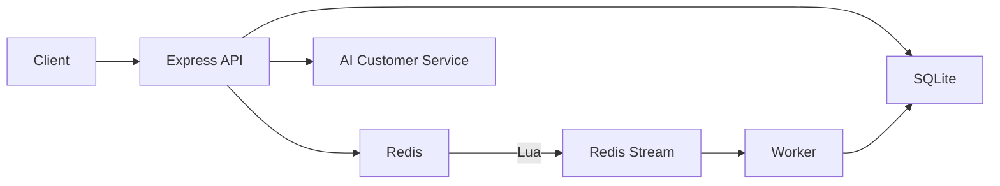

# OldPhoneStore

二手手机商城全栈项目 · Docker 一键启动 · Redis 高并发 · 智能客服


**Stack:** Express · SQLite · Redis · JWT · Lua / Stream · RAG Chat

---

## 核心技术点

| 模块 | 技术点 |
|------|--------|
| 商品缓存 | Cache Aside；空值缓存防穿透；互斥锁防击穿；TTL 随机抖动防雪崩 |
| 限时秒杀 | Redis + Lua 原子扣库存、一人一单；成功后写入 Stream，Worker 异步落库 |
| 订单链路 | 状态机 `pending → paid → shipped → completed / cancelled`；`Idempotency-Key` 防重复下单；条件更新幂等支付；超时关单并回滚库存 |
| 用户体系 | JWT 登录注册；Redis Session |
| 管理端 | `/admin` 仪表盘、订单流转、秒杀库存监控 |

### 智能客服

右下角聊天窗接入客服 Agent：

- **FAQ RAG** — 保修 / 物流 / 退货 / 成色等知识库检索
- **Tool 调用** — 搜手机、查订单、列秒杀活动
- **多轮记忆** — Redis 保存近期对话上下文
- **可选大模型** — 配置 `OPENAI_API_KEY`（兼容 OpenAI 接口）后由 LLM 生成回复；未配置时走本地规则引擎，功能仍可完整演示
- **流式输出** — 支持 SSE（`stream: true`）



---

## Quick start

```bash
git clone https://github.com/kikiarya/OldPhoneStore.git
cd OldPhoneStore
docker compose up --build -d
```

| | |
|--|--|
| 商城 | http://localhost:3000 |
| 管理端 | http://localhost:3000/admin |
| Buyer | `buyer@oldphonestore.demo` / `buyer123` |
| Admin | `admin@oldphonestore.demo` / `admin123` |

本地开发：`cp .env.example .env && npm install && npm start`（建议本机起 Redis，未启动时秒杀自动降级 SQLite）。

---

## Modules

- **Catalog** — 搜索 / 品牌 / 成色筛选，详情接口带 `X-Cache-Source`
- **Cart checkout** — 事务扣库存 + 幂等下单
- **Flash deals** — 首页秒杀区，登录后抢购
- **Chat widget** — 智能客服；配 `OPENAI_API_KEY` 可接大模型
- **Admin** — 营收 / 库存 / 订单状态 / 超时扫描

---

## API

| | Path |
|--|--|
| Auth | `POST /api/auth/login` `register` · `GET /api/auth/me` |
| Phones | `GET /api/phones` ` /meta` ` /:id` |
| Orders | `POST /api/orders` · `POST /:id/pay` · `GET /mine` |
| Flash | `GET /api/flash` · `POST /api/flash/:id/buy` |
| Chat | `POST /api/chat` |
| Admin | `GET /api/admin/dashboard` · orders / phones |
| Health | `GET /api/health` |

```bash
TOKEN=$(curl -s -X POST localhost:3000/api/auth/login \
  -H 'Content-Type: application/json' \
  -d '{"email":"buyer@oldphonestore.demo","password":"buyer123"}' | jq -r .token)
curl -s -X POST localhost:3000/api/flash/1/buy -H "Authorization: Bearer $TOKEN"
```

---

## Layout

```
server/
  lua/seckill.lua          # 秒杀原子脚本
  services/cacheService.js # 缓存穿透 / 击穿 / 雪崩
  services/seckillService.js
  services/orderWorker.js  # Stream 消费 + 超时关单
  services/chatService.js  # RAG + Tools
  routes/                  # auth · phones · orders · flash · admin · chat
public/                    # 商城 + /admin
docker-compose.yml         # web + redis
```

---

## License

MIT
