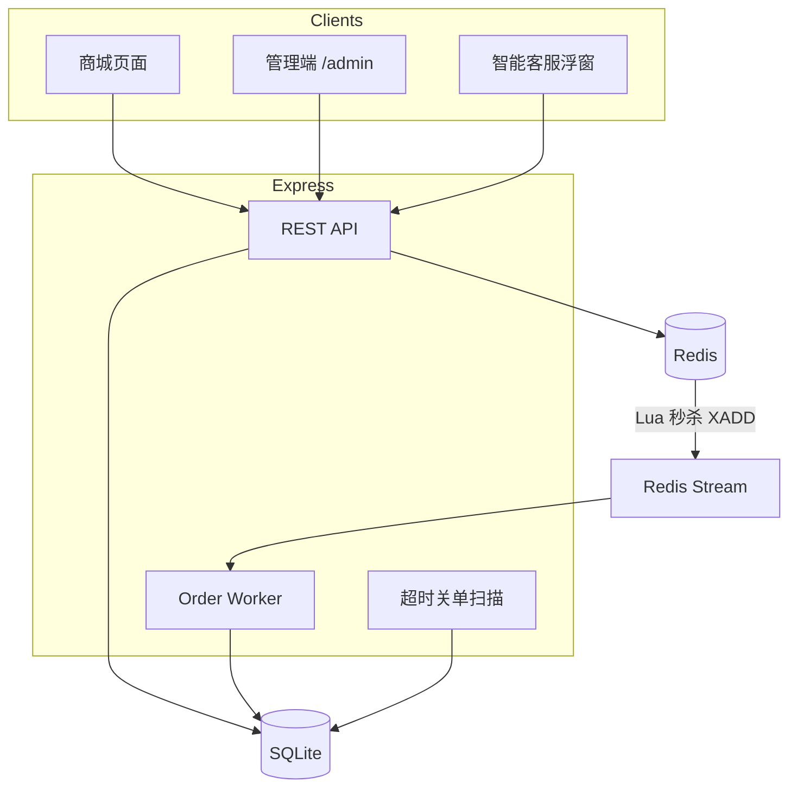
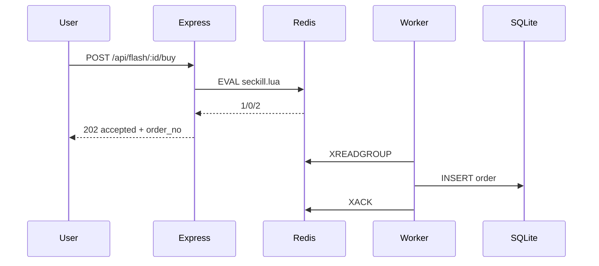
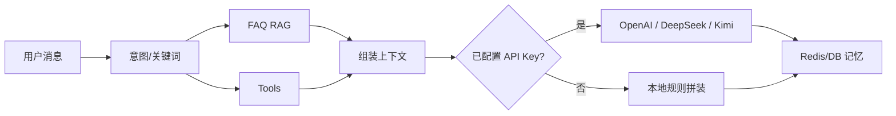

# OldPhoneStore 项目讲解

> 面向作品集展示与面试口述：每个重点都按 **业务场景 → 会出什么问题 → 为什么这样设计 → 本仓库怎么落地 → 怎么演示** 来讲。

---

## 1. 项目一句话

**OldPhoneStore** 是一个可 Docker 一键运行的二手手机电商全栈 Demo：用户端逛店下单 / 限时秒杀，管理端看盘改单，右下角智能客服能查政策、搜机、查单。

它不是空壳 CRUD，重点在：**缓存一致性思路、秒杀原子性、订单状态与幂等、异步削峰、客服 Agent（RAG + Tool）**。

---

## 2. 技术栈

| 层 | 选型 | 作用 |
|----|------|------|
| 前端 | 原生 HTML / CSS / JS | 商城页、秒杀区、登录、聊天窗、`/admin` |
| 后端 | Node.js ≥18 + Express | REST API、静态资源、后台 Worker |
| 持久化 | SQLite（`better-sqlite3`） | 商品 / 用户 / 订单 / 秒杀活动 / 聊天记录 |
| 缓存与协调 | Redis 7（`ioredis`） | 商品缓存、Session、秒杀库存、Stream 队列、客服短期记忆 |
| 认证 | JWT + bcryptjs | 登录态；可选写入 Redis Session |
| 部署 | Docker Compose | `web` + `redis` 一键起 |

**设计取舍（要能讲清楚）：**

- 作品集优先「一键跑通 + 技术点完整」，所以默认 **SQLite + Redis**，不强制上 MySQL 集群。
- Redis 挂掉时应用 **降级**：缓存跳过、秒杀走 SQLite 乐观锁、客服记忆回落数据库——保证 Demo 不彻底挂死。

---

## 3. 整体架构



**请求主路径：**

1. 读多写少的商品详情 → 优先 Redis，未命中再查库并回填。
2. 购物车下单 → SQLite 事务 + 条件更新库存字段。
3. 秒杀下单 → Redis Lua 先做资格判断 → Stream 异步落单。
4. 客服对话 → 意图 / FAQ / Tool →（可选）LLM → 回写记忆。

---

## 4. 业务模块总览

| 模块 | 用户能感知到什么 | 核心代码 |
|------|------------------|----------|
| 商品目录 | 搜索、品牌/成色筛选、详情 | `routes/phones.js` |
| 登录注册 | JWT；Header 带 `Authorization` | `routes/auth.js` `middleware/auth.js` |
| 购物车下单 | 本地购物车 → 创建 pending 订单 | `routes/orders.js` |
| 限时秒杀 | 首页 Flash · 登录抢购 | `routes/seckill.js` `lua/seckill.lua` |
| 订单状态 | 支付 / 取消 / 管理端改状态 | `routes/orders.js` `routes/admin.js` |
| 超时关单 | pending 超时回滚库存 | `services/orderWorker.js` |
| 智能客服 | 右下角聊天 | `services/chatService.js` `routes/chat.js` |
| 管理端 | 仪表盘、订单列表 | `public/admin.html` |

Demo 账号：

| 角色 | 邮箱 | 密码 |
|------|------|------|
| 买家 | `buyer@oldphonestore.demo` | `buyer123` |
| 管理员 | `admin@oldphonestore.demo` | `admin123` |

---

## 5. 重点设计讲解

下面每一节都可以单独当成一段面试口述稿。

---

### 5.1 用户登录：JWT + Redis Session

#### 业务场景

用户要抢秒杀、看「我的订单」、进管理端，必须有身份。纯前端 localStorage 存「我是谁」不可信。

#### 会出什么问题

- 只靠前端标记身份 → 可伪造。
- 服务多实例时，若 Session 只存在某一台内存 → 登录态丢失。
- 密码明文存储 → 直接不合格。

#### 设计方案

1. 密码用 **bcrypt** 哈希入库。
2. 登录成功签发 **JWT**（payload：`sub/email/role/name`）。
3. 同时把用户摘要写入 Redis：`session:{userId}`，并设过期时间与 Token TTL 对齐。
4. 需要登录的接口走 `authRequired`；管理端再加 `adminRequired`。

#### 本仓库落地

- 注册 / 登录 / 登出 / me：`server/routes/auth.js`
- 中间件：`server/middleware/auth.js`
- 前端把 token 放 `localStorage`，请求时加 `Authorization: Bearer …`

#### 怎么讲 / 怎么演示

口述：「无状态 JWT 方便水平扩展；Redis Session 方便集中失效（登出删 key）。」  
演示：登录后抢秒杀；Logout 后再抢应 401。

---

### 5.2 商品查询缓存：穿透 / 击穿 / 雪崩

电商课里「商户/商品详情缓存」几乎是必讲段，本仓库对应 **手机详情与 meta**。

#### 业务场景

详情页、筛选元数据会被反复读；秒杀前也可能打热点商品。若每次打 SQLite，单机磁盘和连接很快成为瓶颈。

#### 三个经典问题

| 问题 | 含义 | 典型诱因 |
|------|------|----------|
| **缓存穿透** | 查不存在的数据，缓存永远不命中，请求打穿到 DB | 乱扫 id、恶意请求 |
| **缓存击穿** | 热点 key 正好过期，大量请求同时重建 | 爆款详情 TTL 到期 |
| **缓存雪崩** | 大量 key 同时过期，DB 瞬时被打满 | 同一 TTL 批量写入 |

#### 设计方案（Cache Aside）

```
读：Redis → 命中则返回
     → 未命中 →（拿互斥锁）→ 查 DB → 写入 Redis → 返回
写：改 DB 后删除对应缓存（本项目在下单/管理端改价时 del）
```

对应手段：

1. **穿透**：DB 也没有时，缓存特殊空值标记 `__NULL__`（短 TTL）。
2. **击穿**：`SET lock:key NX EX` 互斥重建；没抢到锁的请求短暂等待再读缓存。
3. **雪崩**：TTL = 基础时间 + 随机抖动（`jitterTtl`）。

#### 本仓库落地

- 封装：`server/services/cacheService.js` → `cacheAside`
- 使用：`GET /api/phones/:id`、`GET /api/phones/meta`
- 响应头：`X-Cache-Source`（`redis` / `db` / `db-cached`）便于演示命中情况
- 失效：下单成功、管理端改商品时 `cacheDel('phone:{id}', 'phones:meta')`

#### 怎么讲 / 怎么演示

口述顺序建议：**先讲 Cache Aside → 再分别抛三个问题与对策**。  
演示：连续两次请求同一详情，观察 `X-Cache-Source` 从 `db-cached` 变为 `redis`；请求不存在 id，应快速返回且不反复重查询（空值缓存）。

---

### 5.3 限时秒杀：Lua 原子扣库存 + Stream 异步下单

这是并发部分的「招牌戏」。

#### 业务场景

活动价手机限量 50 台，开抢瞬间流量远高于普通下单。要同时保证：

1. **不超卖**
2. **一人一单**
3. **接口尽快返回**（别让所有人堵在写数据库上）

#### 会出什么问题

- 先 `GET` 库存再 `DECR`：两步非原子 → 超卖。
- 只用 JVM / Node 进程内锁：多实例部署锁不住。
- 同步写订单：库存判断很快，落库很慢 → 接口超时、连接打满。

#### 设计方案（两段式）

**第一段（热路径，只碰 Redis）：** 用 Lua 脚本在 Redis 单线程里串行执行：

1. 读库存，≤0 则失败  
2. `SISMEMBER` 判断用户是否已买  
3. `DECR` 库存 + `SADD` 买家集合  
4. `XADD` 把 `{userId, dealId, orderNo}` 推进 Stream  

**第二段（冷路径，异步）：** Worker 用消费者组 `XREADGROUP` 拉消息，写入 SQLite 订单，再 `XACK`。



#### 本仓库落地

- Lua：`server/lua/seckill.lua`
- 服务：`server/services/seckillService.js`（预热库存、调用 Lua、SQLite 降级）
- Worker：`server/services/orderWorker.js`
- 路由：`POST /api/flash/:id/buy`（必须登录）
- 启动时：`warmAllActiveDeals()` 把 `stock - sold` 灌进 `flash:stock:{id}`

返回码约定：`1` 成功，`0` 售罄，`2` 已买过。

#### Redis 不可用时

走 `syncSeckillSqlite`：事务内检查库存、`sold < stock` 条件更新、查是否已有该用户该活动订单——保证 Demo 仍可讲「一人一单 / 防超卖」，只是没有异步削峰。

#### 怎么讲 / 怎么演示

口述抓三点：**原子性（Lua）→ 公平（一人一单）→ 削峰（Stream）**。  
演示：buyer 登录抢购 → 返回 `order_no` → 管理端或 `GET /api/orders/mine` 看到订单；同一用户再抢同一活动应报「已领取」。

---

### 5.4 普通下单：事务防超卖 + 幂等

#### 业务场景

二手机多数是「一机一卖」：`phones.available` 为 0/1。用户点两次「下单」不能生成两笔。

#### 设计方案

1. **SQLite 事务**里读机 → 校验 `available` → 插入订单与明细 → `UPDATE … SET available=0 WHERE id=? AND available=1`。  
   `changes === 0` 说明被人抢先买走 → 整单回滚。
2. 请求头 **`Idempotency-Key`**：  
   - 先查库是否已有同 key 订单 → 直接返回旧结果（重试安全）  
   - Redis `SETNX` 短锁挡住并发双击窗口  
3. 生成业务单号 `order_no`（`OPS…`），便于客服查询。

#### 本仓库落地

`server/routes/orders.js` · 前端 checkout 使用 `crypto.randomUUID()` 作为幂等键。

#### 怎么讲

「库存用条件更新表达乐观并发；幂等键保证客户端重试不会下双份。」

---

### 5.5 订单状态机、幂等支付、超时关单

订单课常见主线：状态怎么流转、支付回调怎么防重、未支付怎么释放库存。

#### 状态机

```
pending → paid → shipped → completed
   │        │
   └────────┴──→ cancelled
```

- 购物车下单：进入 `pending`
- 秒杀成功异步落单：直接 `paid`（Demo 简化，活动价视为已抢到资格）
- 用户：`POST /api/orders/:id/pay`、`/cancel`
- 管理端：任意合法状态迁移

#### 支付幂等（条件更新）

真实支付会有「回调多次」。本仓库用同一模式：

```sql
UPDATE orders SET status = 'paid', ...
WHERE id = ? AND status = 'pending'
```

只有从 `pending` 成功迈出一步的那次生效；重复回调 `changes=0`。

#### 超时关单

`pending` 且超时（默认 15 分钟）→ 置 `cancelled` → 购物车单把手机 `available` 改回 1。  
实现：`cancelStalePendingOrders` + 启动时 `setInterval` 扫描；管理端也可手动 `POST /api/admin/orders/timeout-scan`。

> 说明：生产可用延迟队列；本仓库用定时扫描，实现简单、故事完整。

#### 怎么讲

按「状态机图 → 条件更新 → 超时释放」三句讲完即可。

---

### 5.6 管理端

#### 业务场景

运营要看：库存、营收、秒杀进度、改订单状态。

#### 落地

- 页面：`/admin`（`public/admin.html` + `admin.js`）
- 接口：`/api/admin/*`，全部 `adminRequired`
- 能力：dashboard、订单筛选、改状态、改商品、创建秒杀、触发超时扫描

#### 怎么演示

`admin@…` 登录 → 看 Flash sold/stock → 把一笔订单改为 `shipped`。

---

### 5.7 智能客服：RAG + Tool + 记忆 + 可选 LLM

客服不是「固定 FAQ 按钮」，而是一个 **能查业务的小 Agent**。

#### 业务场景

用户问：「保修多久？帮我看看有没有 iPhone」「我的订单 OPS… 到哪了」「现在有什么秒杀？」

#### 整体链路



#### 1）FAQ RAG（检索增强）

知识库：`server/knowledge/faq.json`（保修、物流、退货、成色、支付说明、秒杀说明等）。  
检索：按 `tags` / 问题文本打分，取 Top3，塞进上下文——回答有依据，减少胡编。

> 作品集级 RAG：关键词检索即可讲清「先检索再生成」。生产可换成向量库（Embedding + 相似度）。

#### 2）Tool 调用（接业务系统）

| Tool | 作用 |
|------|------|
| `toolSearchPhones` | SQL 模糊搜手机 |
| `toolGetOrder` | 按 `order_no` / id 查单（校验归属） |
| `toolListFlashDeals` | 列出秒杀剩余 |

意图路由在 `detectIntent`：订单号、秒杀词、搜索词、政策词等。多意图句子会同时召回 FAQ + Tools。

#### 3）多轮记忆

- Redis List：`chat:mem:{sessionId}`，`LTRIM` 只留最近约 20 条，TTL 7 天。  
- SQLite：`chat_sessions` / `chat_messages` 持久化，便于审计与 Redis 降级。

前端保存 `session_id`，继续聊才能引用上文。

#### 4）可选 LLM（OpenAI / DeepSeek / Kimi）

客服调用统一走 **OpenAI 兼容** 的 `/chat/completions`。通过 `LLM_PROVIDER` 切换厂商预设：

| `LLM_PROVIDER` | 默认 Base URL | 默认模型 | Key 环境变量 |
|----------------|---------------|----------|--------------|
| `openai`（默认） | `https://api.openai.com/v1` | `gpt-4o-mini` | `LLM_API_KEY` 或 `OPENAI_API_KEY` |
| `deepseek` | `https://api.deepseek.com/v1` | `deepseek-chat` | `LLM_API_KEY` 或 `DEEPSEEK_API_KEY` |
| `kimi` | `https://api.moonshot.cn/v1` | `moonshot-v1-8k` | `LLM_API_KEY` 或 `KIMI_API_KEY` / `MOONSHOT_API_KEY` |

也可手动覆盖 `LLM_BASE_URL` / `LLM_MODEL`（兼容旧名 `OPENAI_BASE_URL` / `OPENAI_MODEL`）。

配置后把 FAQ/Tool 结果写入 system 上下文再生成回复；**未配置任何 Key** 时走 `buildLocalReply` 本地拼装——功能闭环仍完整。  
实现：`server/services/llmConfig.js` · `callLlm` in `chatService.js`；`GET /api/health` 的 `llm` 字段可查看当前启用状态。

示例（DeepSeek）：

```bash
LLM_PROVIDER=deepseek
LLM_API_KEY=sk-...
```

示例（Kimi）：

```bash
LLM_PROVIDER=kimi
LLM_API_KEY=sk-...
# 可选长上下文: LLM_MODEL=moonshot-v1-32k
```

#### 5）流式输出

`POST /api/chat` body 里 `stream: true` → SSE 分片推送（打字机效果）。默认商店 UI 用非流式，接口已支持流式。

#### 本仓库落地

- `server/services/chatService.js`
- `server/routes/chat.js`
- 前端：`public/js/app.js` 聊天浮窗

#### 怎么讲 / 怎么演示

口述结构：**RAG 负责「说得准」→ Tool 负责「办得了」→ Memory 负责「记得住」→ LLM 负责「说人话」**。  
演示三句：

1. 「保修多久」→ 命中 FAQ  
2. 「推荐 iPhone」→ Tool 返回机型列表  
3. 「现在有什么秒杀」→ 列出活动剩余  

---

## 6. 数据模型（精简）

| 表 | 用途 |
|----|------|
| `phones` | 二手机库存（`available` 0/1） |
| `users` | 账号（`role`: user/admin） |
| `orders` | 订单头（`status` `order_no` `idempotency_key` `source` `flash_deal_id`） |
| `order_items` | 订单行 |
| `flash_deals` | 秒杀活动（`stock`/`sold`） |
| `chat_sessions` / `chat_messages` | 客服会话 |

Redis Key 约定：

| Key | 含义 |
|-----|------|
| `phone:{id}` / `phones:meta` | 商品缓存 |
| `session:{userId}` | 登录会话摘要 |
| `flash:stock:{dealId}` | 秒杀剩余 |
| `flash:buyers:{dealId}` | 已购用户集合 |
| `stream:flash:orders` | 秒杀异步队列 |
| `chat:mem:{sessionId}` | 客服短期记忆 |
| `idem:order:…` | 下单幂等短锁 |

---

## 7. 目录地图

```
server/
  index.js                 # 启动：连 Redis、预热秒杀、起 Worker、超时扫描
  db.js                    # SQLite schema + 迁移
  redis.js                 # 连接与降级标志
  seed.js                  # 手机 / Demo 用户 / 秒杀种子
  lua/seckill.lua          # 秒杀原子脚本
  middleware/auth.js
  services/
    cacheService.js        # 穿透/击穿/雪崩
    seckillService.js
    orderWorker.js
    chatService.js
  knowledge/faq.json
  routes/                  # auth phones orders flash admin chat
public/                    # 商城 + admin
docker-compose.yml
```

---

## 8. 推荐演示脚本（5～8 分钟）

1. `docker compose up --build -d`，打开商城与 `/admin`。  
2. `GET /api/health`：展示 `features` 与 `redis: true`。  
3. 连续打开同一手机详情，讲 `X-Cache-Source`。  
4. buyer 登录 → Flash Seckill → 返回 `order_no` → 再抢同一场失败。  
5. 购物车下一单，强调 `Idempotency-Key`；`/pay` 讲条件更新。  
6. 客服问保修 / 搜机 / 问秒杀。  
7. admin 改订单状态、看 dashboard 秒杀进度。

---

## 9. 面试口述提纲（短版）

1. **缓存**：Cache Aside；空值防穿透；互斥锁防击穿；TTL 抖动防雪崩。  
2. **秒杀**：资格判断前置到 Redis；Lua 保原子；Stream 异步落库削峰；一人一单用 Set。  
3. **订单**：状态机；幂等键；`WHERE status='pending'` 支付防重；超时关单释放库存。  
4. **客服**：FAQ RAG + 业务 Tool + Redis 多轮记忆 + 可选 LLM；无 Key 也可演示。  
5. **工程**：Docker Compose 一键；Redis 降级策略；JWT + 角色管理端。

---

## 10. 启动命令速查

```bash
docker compose up --build -d
# 商城 http://localhost:3000
# 管理 http://localhost:3000/admin
```

本地：

```bash
cp .env.example .env
npm install
npm start
```

相关环境变量见仓库根目录 `.env.example`（`REDIS_URL`、`JWT_SECRET`、可选 `LLM_PROVIDER` + `LLM_API_KEY`，支持 OpenAI / DeepSeek / Kimi）。

云端部署（Railway 推荐）：见同目录 [DEPLOY.md](./DEPLOY.md)。

---

*本文档描述的是当前仓库实现，便于学习与展示；生产环境还需真实支付、风控、监控告警、合规与更完善的运维体系，可在此底座上继续迭代。*
